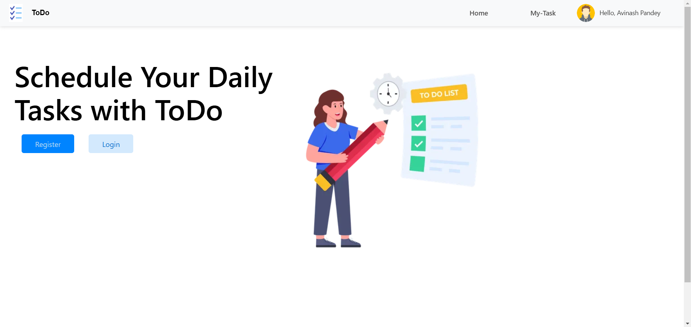
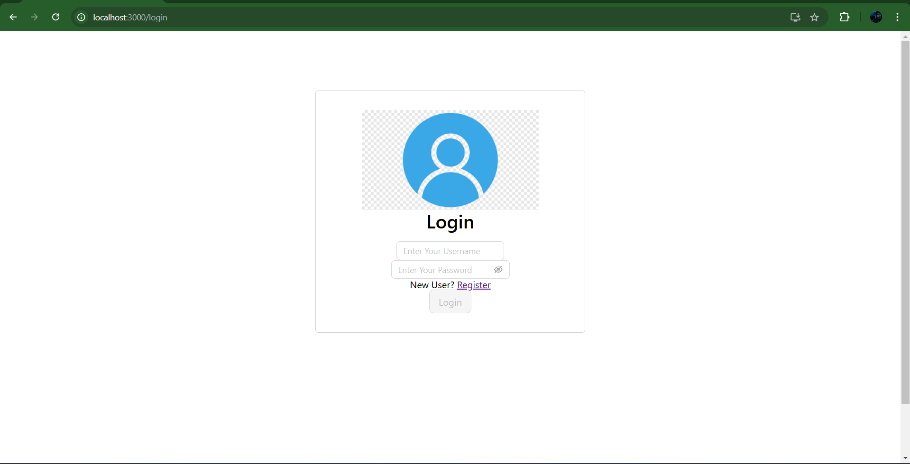
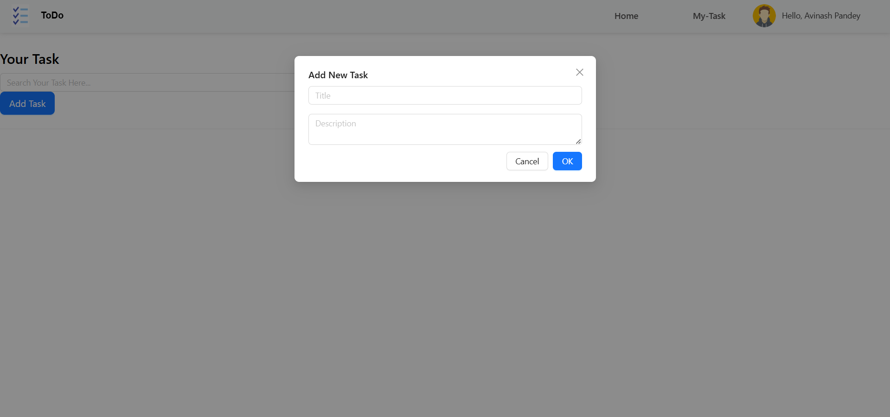

# Todo List Application

A full-stack Todo List application built with React.js for the frontend, Node.js for the backend, and MongoDB for storing data. This project allows users to manage tasks by adding, editing, deleting, and marking them as completed.

## Features

- **Create Todo**: Add new tasks to your to-do list.
- **Edit Todo**: Update existing tasks.
- **Delete Todo**: Remove tasks from the list.
- **Mark Todo as Completed**: Toggle the status of tasks between pending and completed.
- **Responsive Design**: Mobile-friendly interface to ensure a seamless experience across devices.

## Technologies Used

- **Frontend**:
  - React.js
  - React Router
  - Axios
  - CSS
- **Backend**:
  - Node.js
  - Express.js
  - MongoDB
- **Development Tools**:
  - npm
  - VS Code (IDE)

## Prerequisites

Ensure you have the following installed:

- **Node.js** (version >=14)
- **npm** (version >=6)
- **MongoDB**: You can use [MongoDB Atlas](https://www.mongodb.com/cloud/atlas) or a local MongoDB instance.

## Setup Instructions

### 1. Clone the repository

First, clone the repository to your local machine:

```bash
git clone https://github.com/yourusername/todo-list-app.git
cd todo-list-app
```
### 2. Setting up the Backend

Navigate to the server folder and install the necessary dependencies:

```bash
cd server
npm install

```
##### The backend code avaliable at:

```bash
(https://github.com/avinash38143/To_DoApplication)

```
### 3. Start the Backend Server
Start the backend server:

```bash

npm start
```

### 4. Ensure Both Frontend and Backend are Running
#### Backend: Make sure the backend server is running on http://localhost:5000.
#### Frontend: The frontend will be running on http://localhost:3000.

## Screenshots

1. **Homepage:**
   

2. **Login:**
   

3. **Add Todo:**
   
